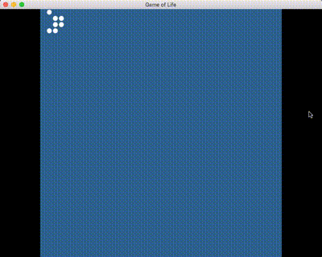

# Game of Life

A demo implementation of [Conway's Game of Life](https://en.wikipedia.org/wiki/Conway%27s_Game_of_Life) using C++



## Features

- 📐 Custom size support
- ⏯ Pausing / Editing
- 🔎 Moving / Zooming
- 🚀 Speed Adjustment 

## Requirements

- CMake

## Development

### Dependencies

- [SFML](https://www.sfml-dev.org/)([Github](https://github.com/SFML/SFML))

(Skip this step for Mac users)

1. Download SFML binaries of your system from [SFML Download Page](https://www.sfml-dev.org/download.php)
1. Replace `include` and `lib` in project with the same directories what you download
1. `*.dll` for Windows and `*.so` for Linux in `lib` are required, ensure they are placed where could be loaded by executable. eg. together with the executable

### Build

```bash
cd <PATH_TO_THIS_REPO>
mkdir build
cd build
cmake ..
make
```
Then executable `game_of_life` could be found int `<PATH_TO_THIS_REPO>/build`

### Run
```bash
./game_of_life # Run with default world size 40x30
./game_of_life -w 200 -h 160 # Run with world of 200x160 
```

## Manual
Key/Mouse | Operation
--------- | ---------
SPACE | Pause/Resume
F | Toggle cell alive/dead on cursor (while paused)
F5 | Fill the world randomly
W | Zoom in
S | Zoom out
A | Speed down
D | Speed up
Mouse wheel (horizontal) | Change speed
Mouse wheel (vertical) | Scale the world
Mouse left drag | Move the world

## License


